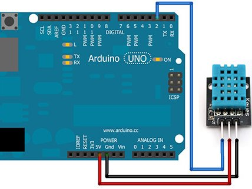

## How to set up
1. Connect arduino to power source (laptop)
2. Connect sensor to arduino as shown below:

3. Open arduino IDE app
4. Connect to correct board name and port number. Run ls /dev/cu.* on terminal to find out all ports
5. Open arduino ino file in IDE and upload the code to the arduino
6. Close arduino IDE app
7. Run the read data python script
8. Look at results in temp_himid_data.csv!
9. I wanted the script to run 24/7, so I moved python script to the raspberry pi and connected the arduinto the pi.
10. Use tmux to run in the background (sudo apt-get install tmux then tmux new -s sensor_log)
11. run the script in the session and detach
12. Check the csv is being updated